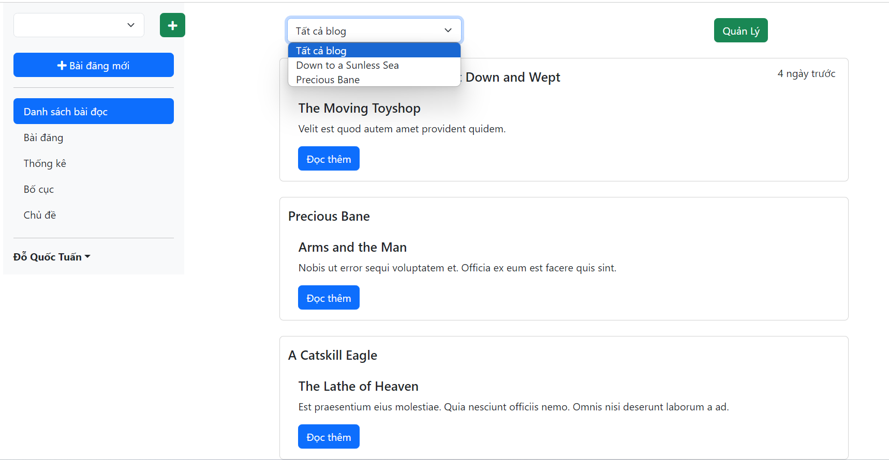

## Giới thiệu:
- Môn học: Lập trình WWW (Java)
- Chủ đề: Bài tập lab 6
   

## Đề bài:

 

## Bài làm:
<b>1.Theo dõi và đọc các blog</b>
- Đăng nhập với mật khẩu sẽ được mã hóa
  
- Khi đăng nhập thành công sẽ chuyển đến giao diện chính và hiển thị một số bài viết mới nhất ngẫu nhiên
  
- Bấm Quản lý để vào giao diện quản lý các blog sẽ hiển thị danh sách các blog đăng theo dõi và form tìm kiếm blog mới
- Nhập tên blog và tìm kiếm
  
- Tìm kiếm thành công nếu muốn theo dõi blog đó thì bấm theo dõi
- Theo dõi thành công sẽ hiển thị ở danh sách các blog đang theo dõi
  
- Nếu không muốn theo dõi nữa nhấn unfollow để hủy theo dõi
- Blog đã hủy theo dõi sẽ không còn hiển thị ở danh sách các blog đang theo dõi
  
- Quay lại giao diện chính có thể xem các bài viết theo từng blog đang theo dõi
  
- Danh sách bài viết theo blog được chọn
  
- Bấm đọc thêm để xem chi tiết bài viết
  
- Có thể bình luận về bài viết 
  
- Nhấn gửi để bình luận .Sẽ hiển thị bình luận mới
  
- Hay nhấn trả lời để trả lời 1 bình luận nào đó
  
- Bấm gửi để gửi câu trả lời.Sẽ được hiển thị dưới bình luận đó
  
   
  <b>2.Quản lý blog của tôi</b>
- Nhấn + để thêm một blog mới  
  
- Nhập thông tin cho blog
   
- Chọn một blog nào đó để xem chi tiết  
  
- Nhấn bài đăng để xem danh sách các bài viết của blog đó
  
- Nhấm thêm bài viết và nhập thông tin cho bài viết để thêm bài viết mới
  
- Sau khi thêm thành công sẽ hiển thị danh sách các bài viết của blog đó
  
- Nhấn edit để sửa bài viết

- Sửa thành công
  
- Xóa bài viết
  